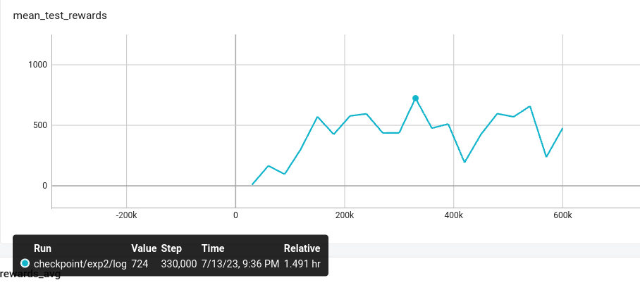
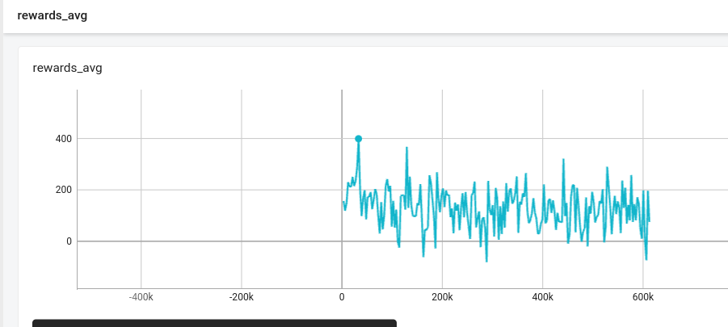
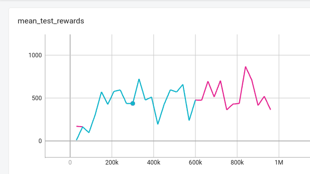
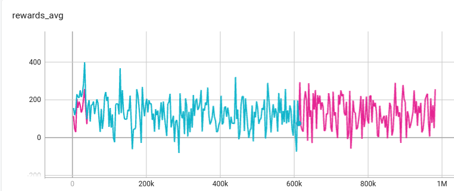
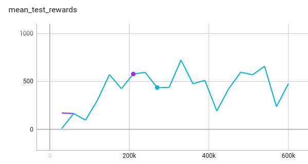
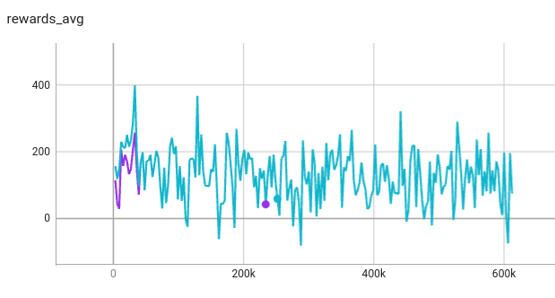
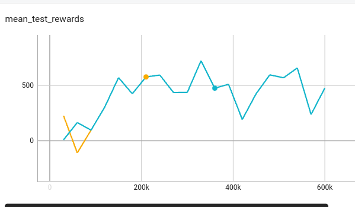
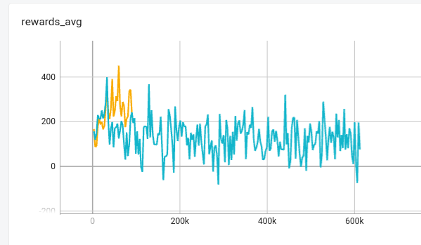
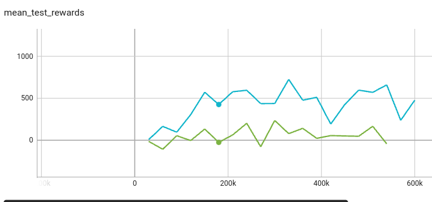
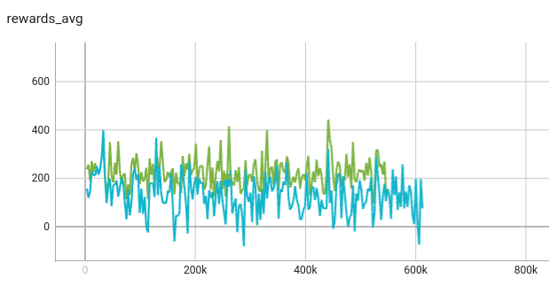

# RL trading bot

## 環境安裝

```
pip install -r requirement.txt
```

## Experiment

目前模型在訓練過程中雖然平均有獲益但是沒有明顯上升，各種改動的效果如下，藍色的線是 baseline，可以看到大部分實驗的訓練過程雖然一開始會有差異但到最後都會變成同一條線。

### Experiment environment

模型每個 time step 可以操作 5 家公司的股票('3231.TW', '2356.TW', '2610.TW', '2330.TW', '0050.TW')
每次操作 30 天觀察最後一天獲益多少(總資產-初始資產)
Test reward 的數值為 100 個 episode 的平均，測試資料的日期從 2021 年初到現在，每個 episode 從這個日期區間抽樣 30 天給模型操作
Training reward 的數值也是 100 個 episode 的平均，日期從2010到2020年底

### baseline

<p align="center" width="100%">
    
</p>
<p align="center" width="100%">
    
</p>

### 對 state 取 log 做 normalize

<p align="center" width="100%">
    
</p>
<p align="center" width="100%">
    
</p>

### 將 state 轉換成 z-score 做 normalize 

<p align="center" width="100%">
    
</p>
<p align="center" width="100%">
    
</p>

### gradient clip

<p align="center" width="100%">
    
</p>
<p align="center" width="100%">
    
</p>

### 限制模型一次只能買或賣 10 個單位

<p align="center" width="100%">
    
</p>
<p align="center" width="100%">
    
</p>

